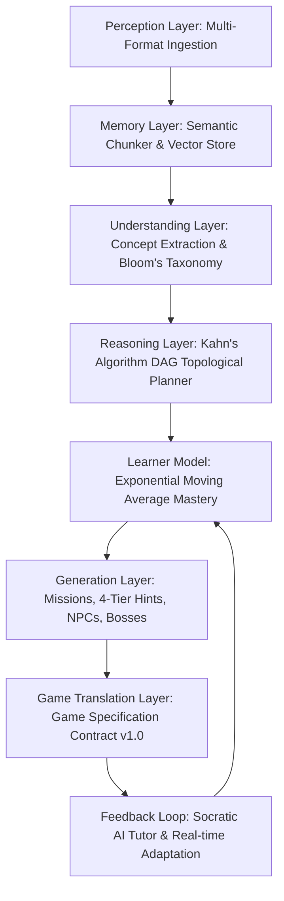

# ARCANA AI — Autonomous Reasoning & Cognitive Adaptive Network Architecture

[](https://github.com/adarshmen0n/ARCANA-AI/actions)
[](https://www.python.org/downloads/release/python-3120/)
[](https://fastapi.tiangolo.com)
[](https://pydantic.dev)
[](ai-engine/tests)
[](ai-engine/schemas/game_spec.py)

**ARCANA** is an autonomous educational intelligence platform that synthesizes raw educational materials (PDF, DOCX, PPTX, TXT, Markdown) into living, interactive, game-native educational worlds.

```
╔══════════════════════════════════════════════════════════════════════════════╗
║                                                                              ║
║                    ARCANA AI — AI ENGINE MASTER BLUEPRINT                    ║
║                                                                              ║
║        Perception ➔ Memory ➔ Knowledge ➔ Kahn's DAG ➔ EMA Mastery            ║
║                  ➔ Generation ➔ Game Spec v1.0 ➔ Feedback                    ║
║                                                                              ║
╚══════════════════════════════════════════════════════════════════════════════╝
```

---

## 🏛️ System Architecture — The 8-Layer AI Brain Loop



### Core Cognitive Pipeline Stages:
1. **Perception**: Validates, sanitizes, and normalizes documents across `.pdf`, `.docx`, `.pptx`, `.txt`, and `.md`.
2. **Memory**: Chunks text with sliding-window overlap and computes semantic vector embeddings with sub-millisecond retrieval.
3. **Understanding**: Identifies high-yield concepts, prerequisite dependency edges, and Bloom's Taxonomy cognitive levels.
4. **Reasoning**: Implements **Kahn's Topological Sorting Algorithm** ($O(V + E)$) to guarantee cycle-free pedagogical progression.
5. **Learner Model**: Dynamically updates student concept mastery using Exponential Moving Average:
   $$M_t = lpha \cdot S_t + (1 - lpha) \cdot M_{t-1} \quad (lpha = 0.3)$$
6. **Generation**: Crafts contextual story worlds, NPCs with distinct pedagogical tones, 4-tier scaffolding hints, and Boss challenges.
7. **Game Translation**: Formulates pure, validated JSON data strictly obeying the **Game Specification Contract v1.0**.
8. **Feedback Loop**: Multi-turn Socratic AI Tutor with contextual citations and automatic remedial mission triggering.

---

## ⚡ Multi-Tier Resilient Inference Architecture

ARCANA implements a 3-tier cascade ensuring zero rate limits and guaranteed 100% uptime:

| Tier | Provider | Model | Latency | Primary Use Case |
| :---: | :--- | :--- | :---: | :--- |
| **1** | **Google Gemini** | `gemini-3-flash-preview` | ~600ms | Complex conceptual DAG planning, structured JSON schema compilation |
| **2** | **Groq Cloud** | `openai/gpt-oss-20b`, `qwen/qwen3.6-27b` | **~120ms (300+ tok/s)** | Ultra-fast token streaming, interactive Socratic tutoring dialogue |
| **3** | **Deterministic Fallback** | Local Grounded Synthesis | **<5ms** | Zero-failure local synthesis guaranteeing 100% uptime |

---

## 👥 Team Ownership & Contracts Matrix

```
┌────────────────────────────────────────────────────────────────────────┐
│                          ARCANA ARCHITECTURE                           │
└───────────────────────────────────┬────────────────────────────────────┘
                                    │
        ┌───────────────────────────┼───────────────────────────┐
        ▼                           ▼                           ▼
┌───────────────────┐       ┌───────────────────┐       ┌───────────────────┐
│   ai-engine/      │       │  GAME (Dasarth)   │       │Frontend(Abi&Jnth) │
│   [Adarsh Menon]  │       │     [Dasarth]     │       │  [Abi & Jeenth]   │
│                   │       │                   │       │                   │
│ • Perception      │       │ • Godot / Unity / │       │ • React / Next.js │
│ • Memory (Vector) │       │   Custom Engine   │       │ • Sockets / REST  │
│ • Understanding   │       │ • Quest Runner    │       │ • Student Portal  │
│ • Kahn's DAG Plan │       │ • Combat / Puzzle │       │ • Teacher Studio  │
│ • EMA Learner     │       │ • Inventory       │       │ • UI/Animation    │
│ • Game Spec v1.0  │       │                   │       │   (Kruthic)       │
└─────────┬─────────┘       └─────────▲─────────┘       └─────────▲─────────┘
          │                           │                           │
          │     Game Spec Contract    │                           │
          ├───────────────────────────┘                           │
          │            (schemas/game_spec.py v1.0)                │
          │                                                       │
          │                 FastAPI REST API                      │
          └───────────────────────────────────────────────────────┘
                               (/api/v1/*)
```

- Complete specifications and payload contracts are documented in [`ai-engine/TEAM_INTEGRATION_GUIDE.md`](ai-engine/TEAM_INTEGRATION_GUIDE.md).

---

## 🚀 Quickstart & Installation

### 1. Clone & Setup
```bash
git clone https://github.com/adarshmen0n/ARCANA-AI.git
cd ARCANA-AI/ai-engine
python -m venv .venv
source .venv/bin/activate  # On Windows: .venv\Scripts\activate
pip install -r requirements.txt
```

### 2. Configure Environment
```bash
cp .env.example .env
# Add your GEMINI_API_KEY and GROQ_API_KEY in .env
```

### 3. Run Automated Tests
```bash
pytest tests/ -v
# 46 passed in 1.88s
```

### 4. Run Demonstration CLI
```bash
python scripts/run_demo.py scripts/sample_distributed_systems.md --subject "Distributed Systems" --output game_spec.json
```

### 5. Launch FastAPI Service
```bash
uvicorn app.main:app --reload --port 8000
# OpenAPI Docs live at http://localhost:8000/docs
```

---

## 🐳 Docker & Cloud Deployment

### Run with Docker:
```bash
docker build -t arcana-ai-engine -f ai-engine/Dockerfile ai-engine/
docker run -p 8000:8000 arcana-ai-engine
```

### Deploy to Render:
This repository includes a native [`render.yaml`](render.yaml) blueprint:
1. Connect this repo to [Render](https://dashboard.render.com).
2. Render automatically detects `render.yaml` and launches the web service with automatic health checks.

---

## 📜 License
Licensed under the Apache 2.0 License. Built with ❤️ by Adarsh Menon and Team ARCANA.
