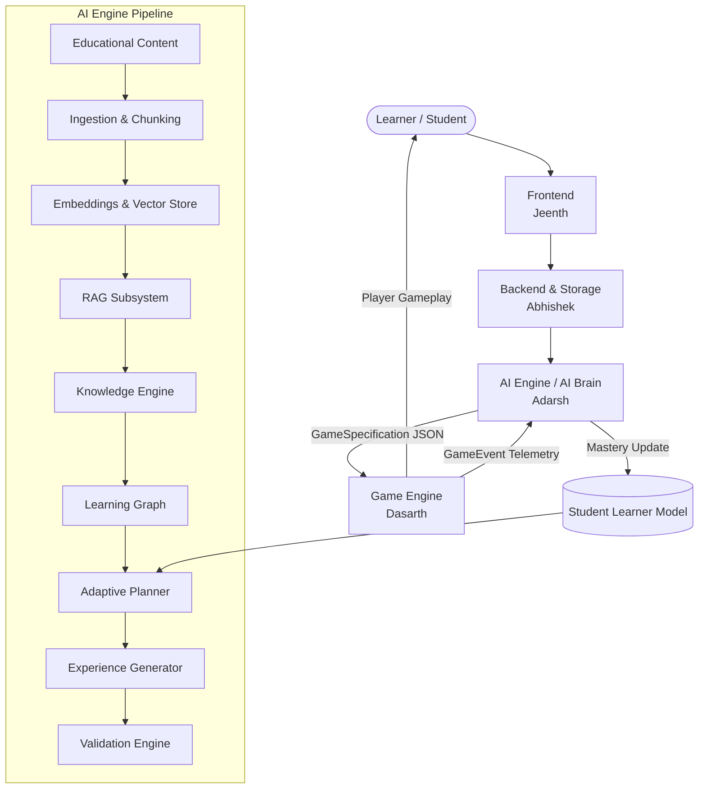

# ARCANA-AI 🧠🎮

> **AI-Powered Personalized Learning & Gamification Platform**

ARCANA-AI is an educational intelligence engine integrated with an adaptive gamified learning experience. It transforms static educational documents (syllabi, textbooks, lecture slides) into structured knowledge graphs, tracks individual student mastery in real time, and dynamically generates game specifications that drive interactive gameplay and challenges.

---

## 🏛️ System Architecture

ARCANA-AI strictly enforces **Separation of Concerns**. The AI Engine owns educational reasoning and generates specifications; the Game Engine consumes specifications to render gameplay and emits learning telemetry back to the AI.


```mermaid
flowchart TD
    User([Learner / Student]) --> Frontend[Frontend\nJeenth]
    Frontend --> Backend[Backend & Storage\nAbhishek]
    Backend --> AIEngine[AI Engine / AI Brain\nAdarsh]
    
    subgraph AI_BRAIN [AI Engine Pipeline]
        Doc[Educational Content] --> Ingest[Ingestion & Chunking]
        Ingest --> Embed[Embeddings & Vector Store]
        Embed --> RAG[RAG Subsystem]
        RAG --> Knowledge[Knowledge Engine]
        Knowledge --> Graph[Learning Graph]
        Graph --> Planner[Adaptive Planner]
        Planner --> Generator[Experience Generator]
        Generator --> Validator[Validation Engine]
    end
    
    AIEngine -->|GameSpecification JSON| GameEngine[Game Engine\nDasarth]
    GameEngine -->|Player Gameplay| User
    GameEngine -->|GameEvent Telemetry| AIEngine
    AIEngine -->|Mastery Update| StudentModel[(Student Learner Model)]
    StudentModel --> Planner
```

---

## 👥 Team & Ownership

This repository houses the entire integrated ARCANA-AI platform. Each top-level directory represents strict domain ownership:

| Team Member | Module Directory | Core Responsibility |
| :--- | :--- | :--- |
| **Adarsh** *(Lead)* | [`ai-engine-adarsh/`](./ai-engine-adarsh/) | **AI Brain & Architecture:** Ingestion, RAG, Knowledge Graph, Mastery Engine, Adaptive Planning, Generators, Game Spec generation, Telemetry processing. |
| **Dasarth** | [`game-engine-dasarth/`](./game-engine-dasarth/) | **Game Engine:** Game loop, physics, level mechanics, NPC interaction, challenge execution, boss fights, health/XP, consuming Game Specs. |
| **Jeenth** | [`frontend-jeenth/`](./frontend-jeenth/) | **Frontend Client:** Application screens, user navigation, learning portal, profile dashboards, AI tutor UI, API integration. |
| **Kruthic** | [`ui-animation-kruthic/`](./ui-animation-kruthic/) | **UI / Animation & Visuals:** Design system, typography, motion design, Lottie animations, visual feedback, asset pipeline. |
| **Abhishek** | [`backend-abhishek/`](./backend-abhishek/) | **Backend Infrastructure:** Database persistence, file storage, user authentication, session state, API gateways. |
| **All** | [`shared/`](./shared/) | **Shared Contracts:** Type definitions, schemas (`GameSpecification`, `GameEvent`), and protocol contracts. |

---

## 🔄 The Closed Adaptive Loop

The core innovation of ARCANA is the **closed feedback loop** between education and gameplay:

1. **Content Ingestion**: Educational material is cleaned, semantically chunked, and embedded.
2. **Knowledge Structuring**: Topics, concepts, and prerequisite relationships form a **Learning Graph**.
3. **Student Assessment**: The **Student Model** measures mastery ($0.0 \rightarrow 1.0$) across concepts.
4. **Adaptive Planning**: The AI Planner determines the optimal next concept and difficulty ($1 \rightarrow 5$).
5. **Game Specification**: The AI generates a structured `GameSpecification` (NPC dialogues, challenges, boss mechanics, rewards).
6. **Gameplay Execution**: The Game Engine renders the mission according to the specification.
7. **Telemetry Feedback**: Player actions trigger structured `GameEvent` telemetry sent back to the AI.
8. **Mastery Update**: The AI recalculates mastery using deterministic scoring and adapts the subsequent learning path.

---

## 📜 Shared Contracts

Modules never communicate through ad-hoc, untyped mechanisms. All cross-module communication is governed by contracts in `shared/`:

- **[AI ➔ Game Contract](shared/contracts/ai-game.md)**: Defines `GameSpecification` payload consumed by the Game Engine.
- **[Game ➔ AI Contract](shared/contracts/game-ai.md)**: Defines `GameEvent` telemetry emitted by the Game Engine.
- **Pydantic Schemas**: [`shared/schemas/`](shared/schemas/) provides runtime validation in Python.
- **TypeScript Definitions**: [`shared/types/`](shared/types/) provides compile-time safety in Frontend and Game clients.

---

## 🌿 Git Branching Strategy

Development follows contract-first parallel branches:

- `main`: Production-ready, fully tested, integrated code.
- `feature/ai-engine`: Adarsh's AI Brain development branch.
- `feature/game-engine`: Dasarth's Game Engine development branch.
- `feature/frontend`: Jeenth's Frontend development branch.
- `feature/ui-animation`: Kruthic's Visual & Animation development branch.
- `feature/backend`: Abhishek's Backend development branch.

---

## 🚀 Getting Started

### Prerequisites
- Python 3.11+
- Node.js 20+

### Setup
```bash
# Clone the repository
git clone https://github.com/adarshmen0n/ARCANA-AI.git
cd ARCANA-AI

# Install AI Engine dependencies (when active on feature/ai-engine)
cd ai-engine-adarsh
python -m venv .venv
source .venv/bin/activate  # On Windows: .venv\Scripts\activate
pip install -r requirements.txt
```

### Running Tests
```bash
pytest tests/
```

---

## 📋 Definition of Done
A feature is marked **DONE** only when:
- [x] Implementation exists and adheres to module boundaries.
- [x] Pydantic schemas and TypeScript contracts validate all I/O.
- [x] Unit and integration tests pass with mocked AI providers.
- [x] Documentation and `docs/project-status.md` are updated.
- [x] No secrets, API keys, or raw LLM responses are left unhandled.
