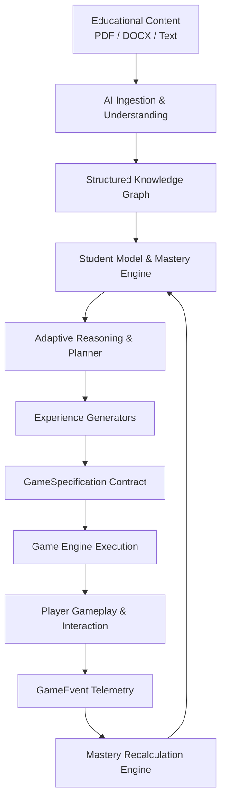

# ARCANA-AI System Architecture 🏛️

**Version**: `1.0.0`  
**Architect**: Adarsh  
**Status**: APPROVED BASELINE

---

## 1. Executive Summary
ARCANA-AI is an educational intelligence and adaptive gamification platform. Its goal is to bridge static learning material (textbooks, PDFs, syllabi) with dynamic game-based mastery verification.

Instead of treating the AI as an external chatbot or the game as a cosmetic wrapper, ARCANA-AI unifies them into a **closed-loop feedback system**:



---

## 2. Architectural Separation of Concerns

Each subsystem possesses exclusive domain authority:

| System | Role | Authority | Non-Authority |
| :--- | :--- | :--- | :--- |
| **AI Engine (Adarsh)** | Educational Brain | Pedagogical objectives, concept ordering, difficulty scaling, question generation, adaptive learning paths, telemetry evaluation. | Physics, animation ticks, pixel rendering, direct SQL databases, mobile UI. |
| **Game Engine (Dasarth)** | Interactive Body | Game loop, player controls, collision, platforming, level rendering, NPC animation, audio trigger, emitting telemetry. | Deciding what concepts to teach, generating quiz questions, calculating mastery curves. |
| **Frontend (Jeenth)** | User Presentation | Screen routing, document upload flows, learning dashboards, graph visualizers, tutor dialogue box, auth state. | Game physics, educational mastery calculations. |
| **UI/Animation (Kruthic)** | Visual Polish | Design tokens, color palettes, micro-interactions, Lottie animations, sound effects, particle feedback. | Application logic, network state, curriculum planning. |
| **Backend (Abhishek)** | Data Persistence | Database migrations, session tokens, file storage (S3/local), persistence of profiles, event logs, background queues. | AI prompting, semantic chunking, game rendering. |
| **Shared Layer** | Contract Bridge | Cross-language typed schemas (`GameSpecification`, `GameEvent`), strict API envelopes. | Implementation details. |

---

## 3. The 9-Stage AI Content Pipeline

When educational content is ingested into ARCANA-AI, it traverses 9 deterministic-to-semantic stages:

```
[Document Upload]
       │
       ▼
1. Validation (File signature, MIME check, size constraint, virus/malware guard)
       │
       ▼
2. Extraction (Text/table extraction preserving document structure)
       │
       ▼
3. Cleaning & Normalization (Deduplication, whitespace cleanup, header/footer removal)
       │
       ▼
4. Structural & Semantic Chunking (Chapter/section detection, paragraph boundaries, token limits)
       │
       ▼
5. Embedding & Vector Indexing (High-dimensional semantic representation stored in Vector DB)
       │
       ▼
6. Knowledge Extraction (Concept detection, definition extraction, relationship identification)
       │
       ▼
7. Learning Graph Generation (Directed Acyclic Graph: prerequisites, dependencies, learning order)
       │
       ▼
8. Pedagogical Objective Mapping (Bloom's taxonomy objective formulation per concept)
       │
       ▼
[Ready for Adaptive Planning]
```

---

## 4. Deterministic vs. Probabilistic AI Rule

A foundational architectural rule in ARCANA-AI is: **Never use an LLM for operations that must be strictly deterministic.**

| Task | Execution Method | Justification |
| :--- | :--- | :--- |
| Schema validation & contract parsing | **Deterministic** (Pydantic / TS) | Zero tolerance for hallucinated fields in machine communication. |
| Mastery score updates | **Deterministic** (Statistical model) | Explainable, reproducible, mathematical grading. |
| Graph topological sorting & paths | **Deterministic** (NetworkX / Graph algos) | Prerequisite order must never cycle or skip dependencies. |
| ID generation & timestamps | **Deterministic** (UUID v4, ISO 8601) | Uniqueness and auditability. |
| Concept & relationship extraction | **AI / LLM** (Gemini + Grounding) | Unstructured semantic understanding. |
| Story, dialogue & hint generation | **AI / LLM** (Structured JSON output) | Creative engagement and progressive pedagogical scaffolding. |
| Natural language tutor explanations | **AI / LLM** (RAG grounded) | Conversational adaptability. |

---

## 5. Architectural Lessons from ARC LEARNS

ARCANA-AI explicitly addresses lessons identified in the earlier `ARC_LEARNS` prototype:

1. **Deployment Architecture First**: CORS, environment configurations, and Docker readiness are set up before deep feature implementation.
2. **Provider Abstraction & Fallback**: AI calls run through an abstract `LLMProvider` interface with automatic exponential backoff and fallback models (e.g. Gemini 2.5 Flash $\rightarrow$ Gemini 2.5 Pro $\rightarrow$ Local Ollama/mock).
3. **Structured Schemas Only**: Unvalidated markdown strings are never piped between systems. All LLM responses pass through Pydantic validators with schema repair mechanisms.
4. **Game Specification Contract**: The game is not retrofitted as a web view quiz; it interacts via the rigorous `GameSpecification` and `GameEvent` protocols.
5. **Separation of Services**: The AI Engine operates as an independent service with dedicated health endpoints (`/health`, `/health/ready`).
